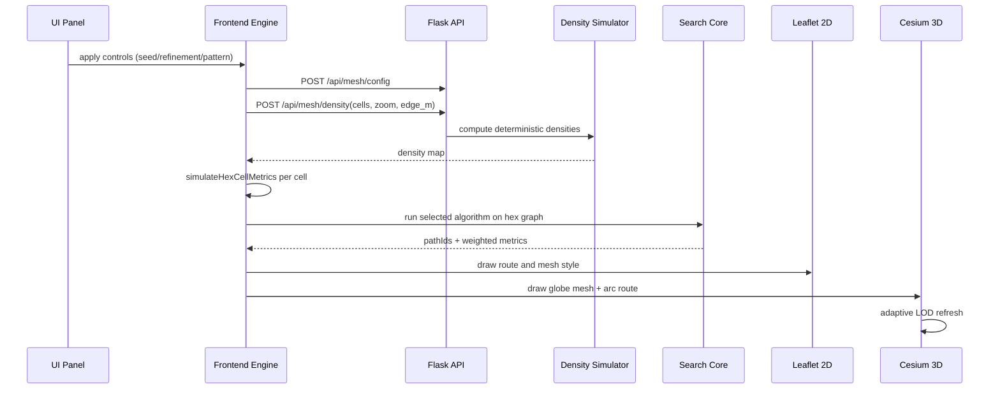
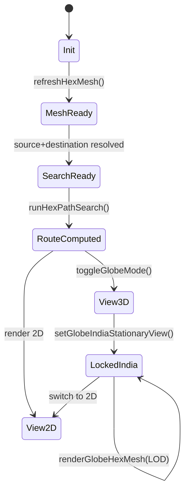

# Smart Route Finder: Hex-Mesh Globe Routing Engine

<pre>
  _____                      _      ____             _        _____ _           _           
 / ____|                    | |    |  _ \           | |      / ____| |         | |          
| (___  _ __ ___   __ _ _ __| |_   | |_) | ___  _ __| |_ ___| (___ | |__   ___ | |_ ___ _ __
 \___ \| '_ ` _ \ / _` | '__| __|  |  _ < / _ \| '__| __/ _ \\___ \| '_ \ / _ \| __/ _ \ '__|
 ____) | | | | | | (_| | |  | |_   | |_) | (_) | |  | ||  __/____) | | | | (_) | ||  __/ |   
|_____/|_| |_| |_|\__,_|_|   \__|  |____/ \___/|_|   \__\___|_____/|_| |_|\___/ \__\___|_|   
</pre>


This project is a deterministic, synthetic, hexagonal traffic-routing model over a world map and 3D globe.

It combines:
- A global hex-mesh simulation layer.
- Per-cell traffic density simulation.
- 50-100 meter geometric scale constraints.
- 50-100 meter geographic height mapping on globe hexes.
- Search algorithms operating directly on the simulated hex graph.

---

## 1) Core Mathematical Model

### 1.1 Hex Edge Scale Constraint

Each hex cell edge length is constrained to:

$$
s \in [50, 100] \text{ meters}
$$

Zoom-adaptive target before refinement:

$$
s_{base}(z) = s_{max} - (\operatorname{clamp}(z,2,20)-2)\cdot 2.5
$$

Refined edge length:

$$
s = \operatorname{clamp}\left(\frac{s_{base}}{r}, 50, 100\right)
$$

where $r$ is the refinement factor.

### 1.2 Density Simulation Per Hex

For hex index $(row, col)$, a deterministic blend produces density:

$$
n_1 = \operatorname{fract}(\sin(12.9898\,row + 78.233\,col + 0.001\,seed)\cdot 43758.5453)
$$

$$
n_2 = \operatorname{fract}(\sin(24.132\,(row+17) + 53.771\,(col-9) + 0.0007\,seed)\cdot 12731.743)
$$

$$
b = 0.65n_1 + 0.35n_2
$$

$$
\rho = \operatorname{clamp}\left(b\cdot(0.45 + 1.35I), 0, 1\right)
$$

where $I$ is traffic intensity.

### 1.3 Geographic Hex Height Mapping

Each hex on the globe is rendered at:

$$
h = h_{min} + \rho(h_{max} - h_{min}),\quad h_{min}=50\text{m},\;h_{max}=100\text{m}
$$

### 1.4 Weighted Hop Cost for Routing

For a hop from hex $u$ to hex $v$:

$$
d_{uv} = \text{haversine}(u,v)\;[\text{km}]
$$

$$
c_{traffic}(v) = 1 + 2.6\rho_v + 0.9p_v
$$

$$
w_{uv} = d_{uv}\cdot c_{traffic}(v)
$$

where $p_v$ is dynamic penalty used for alternative routes.

---

## 2) Algorithms and Working Method

| Algorithm | Objective | Score/Rule | Working Method in This Model |
|---|---|---|---|
| Dijkstra | Minimum weighted cost | $g(v)$ only | Expands lowest cumulative $\sum w_{uv}$ over simulated-density mesh |
| A* | Faster optimal search | $f(v)=g(v)+h(v)$ | Uses weighted cost + haversine heuristic toward destination |
| BFS (BFT) | Breadth-first traversal | FIFO frontier | Traverses by levels; neighbors are density-prioritized |
| DFS (DFT) | Depth-first traversal | LIFO frontier | Dives along density-prioritized branches first |

### Dijkstra

$$
g(v) = \min_{P:s\to v}\sum_{(i,j)\in P} w_{ij}
$$

### A*

$$
f(v)=g(v)+h(v),\quad h(v)=\text{haversine}(v, goal)
$$

### BFS / DFS in Hex Mesh

- BFS uses queue expansion with low-density ordering for tie preference.
- DFS uses stack expansion with low-density ordering for branch preference.

---

## 3) Color System Used in Architecture and Math Narrative

| Semantic | Color |
|---|---|
| API layer | `#1d4ed8` |
| Mesh simulation | `#059669` |
| Routing core | `#b45309` |
| 2D rendering | `#7c3aed` |
| 3D rendering | `#0f766e` |
| State and persistence | `#374151` |

---

## 4) Architecture Diagram (Presentation Grade)

```mermaid
flowchart LR
    U[User Inputs\nSource / Destination / Algorithm / Seed / Refinement] --> FE[Frontend Controller\napp.js]
    FE --> MESH[Hex Mesh Builder\nGlobal Row/Col Window]
    FE --> API[Flask API\napp.py]
    API --> CFG[/api/mesh/config]
    API --> DEN[/api/mesh/density]
    API --> HIST[/api/history]
    CFG --> ENGINE[SmartRouter\ngraph_engine.py]
    DEN --> ENGINE
    ENGINE --> SIM[Density Simulator\nseed + intensity + pattern]
    MESH --> SIM
    SIM --> CELLS[Hex Cells\n(simulatedDensity, geoHeightMeters)]
    CELLS --> SEARCH[Search Core\nDijkstra / A* / BFS / DFS]
    SEARCH --> ROUTE[Route Result\npathIds + metrics]
    ROUTE --> R2D[Leaflet 2D Renderer]
    ROUTE --> R3D[Cesium 3D Renderer\nIndia-locked view]
    CELLS --> R3D

    classDef frontend fill:#ede9fe,stroke:#7c3aed,stroke-width:2,color:#1f1147
    classDef api fill:#dbeafe,stroke:#1d4ed8,stroke-width:2,color:#102a56
    classDef sim fill:#dcfce7,stroke:#059669,stroke-width:2,color:#052e1d
    classDef algo fill:#ffedd5,stroke:#b45309,stroke-width:2,color:#431407
    classDef render fill:#ccfbf1,stroke:#0f766e,stroke-width:2,color:#042f2e
    classDef state fill:#f3f4f6,stroke:#374151,stroke-width:2,color:#111827

    class FE,MESH frontend
    class API,CFG,DEN,HIST api
    class ENGINE,SIM,CELLS sim
    class SEARCH,ROUTE algo
    class R2D,R3D render
    class U state
```

---

## 5) Workflow Diagram: Animation + Route Lifecycle



---

## 6) State Diagram: 3D Presentation Mode



---

## 7) Aesthetic ASCII Architecture Sketch

```text
                   +------------------------------+
                   |         USER CONTROLS        |
                   | src dst algo seed refine mode|
                   +---------------+--------------+
                                   |
                                   v
                      +------------+------------+
                      |     FRONTEND app.js     |
                      | mesh build + rendering  |
                      +-----+--------------+----+
                            |              |
                density req |              | route render
                            v              v
                  +---------+--------+   +------------------+
                  |   FLASK API      |   |  LEAFLET (2D)    |
                  |     app.py       |   +------------------+
                  +---------+--------+
                            |
                            v
                  +---------+----------------------+
                  | SmartRouter / graph_engine.py  |
                  | deterministic density + search |
                  +---------+----------------------+
                            |
                            v
                  +---------+----------------------+
                  | HEX CELLS: rho + geoHeight(m) |
                  +---------+----------------------+
                            |
                            v
                  +---------+----------------------+
                  |  CESIUM (3D) India-locked     |
                  |  globe mesh + route arcs      |
                  +--------------------------------+
```

---

## 8) API Surface

| Endpoint | Method | Purpose |
|---|---|---|
| `/api/graph` | GET | Base graph data |
| `/api/route` | POST | Single algorithm route |
| `/api/compare` | POST | Parallel algorithm comparison |
| `/api/multi-route` | POST | Alternative routes |
| `/api/mesh/config` | GET/POST | Persist/retrieve seed/intensity/pattern/refinement |
| `/api/mesh/density` | POST | Deterministic density map for requested cells |
| `/api/traffic/simulate` | POST | Traffic condition simulation |
| `/api/traffic/reset` | POST | Reset simulation conditions |
| `/api/block` | POST | Block edge/road |
| `/api/history` | GET | Route history |
| `/api/history/clear` | POST | Clear route history |

---

## 9) Project Layout

```text
path finder/
|-- app.py
|-- graph_engine.py
|-- app.js
|-- styles.css
|-- index.html
`-- README.md
```

---

## 10) Run and Present

```bash
python app.py
```

Open:

```text
http://127.0.0.1:5000
```

Presentation flow:
- Show mesh regeneration with seed and refinement.
- Show density-height coupling per hex.
- Run Dijkstra/A*/BFS/DFS and compare weighted behavior.
- Switch to 3D and show stationary India-focused globe mesh with adaptive LOD.

---

## 11) Algorithm Complexity Reference

| Algorithm | Typical Complexity | Notes |
|---|---|---|
| Dijkstra | $O((V+E)\log V)$ | With priority queue |
| A* | Depends on heuristic quality | Best practical runtime with strong heuristic |
| BFS | $O(V+E)$ | Unweighted breadth expansion |
| DFS | $O(V+E)$ | Depth-first traversal |

---

## 12) Author

PASUPULASAITEJA
